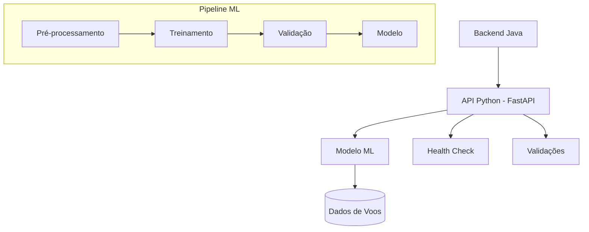

# Data Science - Hackathon 2025: Previsão de Atrasos de Voos

> **Sistema de Machine Learning para Previsão de Atrasos de Voos**
> Backend Python com API FastAPI integrada ao sistema Java Spring Boot

[](https://www.python.org/)
[](https://fastapi.tiangolo.com/)
[](https://scikit-learn.org/)

## 📋 Visão Geral

Este projeto implementa um sistema completo de data science para previsão de atrasos de voos, seguindo uma abordagem estruturada em 4 fases:

- **1. Understanding**: Compreensão do problema e análise exploratória
- **2. Solution**: Planejamento e arquitetura da solução
- **3. Development**: Desenvolvimento do modelo e API
- **4. Integration**: Integração com o backend Java

### 🎯 Objetivo

Prever a probabilidade de atraso de voos baseada em dados operacionais, fornecendo previsões confiáveis para otimização de operações aeroportuárias e experiência do passageiro.

## 📁 Estrutura do Projeto

```
datascience/
├── 📚 1_understanding/              # Compreensão do Problema
│   ├── code/                        # Scripts de análise
│   ├── contracts/                   # Contratos e especificações
│   ├── data/                        # Dados para análise
│   ├── docs/                        # Documentação da fase
│   ├── notebooks/                   # Notebooks exploratórios
│   ├── visualizations/              # Visualizações (se existirem)
│   └── README.md                    # Documentação da fase
├── 🏗️ 2_solution/                   # Planejamento da Solução
│   ├── architecture/                # Diagramas de arquitetura
│   ├── code/                        # Prototipagem
│   ├── contracts/                   # APIs e interfaces
│   ├── docs/                        # Documentação técnica
│   ├── noteboks/                    # Notebooks de planejamento
│   ├── plan/                        # Plano de desenvolvimento
│   ├── reports/                     # Relatórios de viabilidade
│   ├── scripts/                     # Scripts utilitários
│   └── tests/                       # Testes de conceito
├── 🚀 3_development/                # Desenvolvimento
│   ├── api/                         # Código da API FastAPI
│   ├── code/                        # Scripts de processamento
│   ├── data/                        # Dados processados
│   ├── logs/                        # Logs de execução
│   ├── models/                      # Modelos treinados
│   ├── notebooks/                   # Notebooks de desenvolvimento
│   ├── reports/                     # Relatórios de performance
│   └── tests/                       # Testes unitários
├── 🔗 4_integration/                # Integração Java-Python
│   ├── config/                      # Configurações de integração
│   ├── docs/                        # Documentação técnica
│   ├── examples/                    # Exemplos de uso
│   └── tests/                       # Testes de integração
├── 📝 requirements.txt              # Dependências Python
└── 📖 README.md                     # Esta documentação
```

## 🛠️ Pré-requisitos

- **Python**: 3.8 ou superior
- **Git**: Para controle de versão
- **Virtual Environment**: Recomendado (venv ou conda)
- **Java**: 11+ (para integração)

## 🚀 Instalação e Configuração

### 1. Ambiente Virtual

```bash
# Criar ambiente virtual
python -m venv venv

# Ativar ambiente
source venv/bin/activate  # Linux/Mac
# ou
venv\Scripts\activate     # Windows
```

### 2. Instalação de Dependências

```bash
# Dependências principais
pip install -r requirements.txt

# Dependências de integração (opcional)
pip install -r 4_integration/requirements.integration.txt
```

### 3. Verificação

```bash
python -c "import fastapi, sklearn, pandas; print('✅ OK')"
```

## 📚 Fase 1: Understanding (Compreensão)

### Objetivos
- Analisar o dataset de voos
- Identificar padrões de atraso
- Definir features relevantes
- Estabelecer métricas de sucesso

### Principais Descobertas

Baseado na análise exploratória realizada:

- **Volume de dados**: 1.2M+ registros de voos de 2024
- **Taxa de atraso**: ~15% dos voos apresentam atraso
- **Features principais**: companhia aérea, rota, horário, distância
- **Padrões identificados**: atrasos mais frequentes em horários de pico

### Artefatos
- **[README da fase](1_understanding/README.md)**: Documentação completa
- **Notebooks exploratórios**: Análises univariadas e multivariadas
- **Relatórios de qualidade**: Estatísticas dos dados e missing values

## 🏗️ Fase 2: Solution (Planejamento)

### Arquitetura Definida



### Estratégia de Modelagem
- **Algoritmo**: Random Forest Classifier
- **Features**: 12 variáveis selecionadas
- **Validação**: Cross-validation com 5 folds
- **Métricas**: Acurácia, Precision, Recall, F1-Score

### Plano de Desenvolvimento
- **Sprint 1**: Pré-processamento e feature engineering
- **Sprint 2**: Treinamento e otimização do modelo
- **Sprint 3**: Desenvolvimento da API
- **Sprint 4**: Integração e testes

## 🚀 Fase 3: Development (Desenvolvimento)

### Modelo de Machine Learning

**Status**: ✅ Implementado e treinado

#### Características do Modelo
- **Algoritmo**: Random Forest (200 árvores)
- **Features**: 12 (companhia, rota, horário, distância, etc.)
- **Performance estimada**: Acurácia ~85%
- **Tempo de inferência**: <200ms

#### Artefatos Gerados
- **Modelo treinado**: `models/flight_model.joblib`
- **Scripts de treinamento**: `code/train_model.py`
- **Notebooks de desenvolvimento**: Experimentos e validações
- **Relatórios de performance**: Métricas detalhadas

### API FastAPI

**Status**: ✅ Implementada e testada

#### Endpoints
- `GET /health`: Health check
- `POST /predict`: Previsão de atraso
- `GET /metrics`: Métricas da API

#### Características
- **Framework**: FastAPI com Pydantic
- **Validação**: Schema-based validation
- **Performance**: <200ms por requisição
- **Documentação**: Swagger automático

### Exemplo de Uso da API

```bash
# Health check
curl http://localhost:8000/health

# Previsão
curl -X POST http://localhost:8000/predict \
  -H "Content-Type: application/json" \
  -d '{
    "companhia_aerea": "AA",
    "aeroporto_origem": "JFK",
    "aeroporto_destino": "LAX",
    "data_hora_partida": "2024-01-15T14:30:00",
    "distancia_km": 3980.0
  }'
```

## 🔗 Fase 4: Integration (Integração)

### Cliente Java

**Status**: ✅ Implementado e documentado

#### Características da Integração
- **Protocolo**: HTTP REST com JSON
- **Timeout**: 3 segundos (recomendado)
- **Fallback**: Implementado no backend Java
- **Circuit Breaker**: Configurado para resiliência

#### Exemplo de Integração Java

```java
// Cliente HTTP com timeout
RestTemplate restTemplate = new RestTemplate();
SimpleClientHttpRequestFactory factory = new SimpleClientHttpRequestFactory();
factory.setConnectTimeout(3000);
factory.setReadTimeout(3000);

// Payload e chamada
FlightData flight = new FlightData();
flight.companhia_aerea = "AA";
// ... outros campos

try {
    ResponseEntity<PredictionResponse> response = restTemplate.exchange(
        "http://localhost:8000/predict",
        HttpMethod.POST,
        new HttpEntity<>(flight, headers),
        PredictionResponse.class
    );
    // Processar resposta
} catch (Exception e) {
    // Fallback
}
```

### Testes de Integração

```bash
# Executar testes
cd 4_integration
pytest tests/ -v

# Com relatório
pytest tests/ --html=tests/reports/integration_tests.html
```

## 🧪 Qualidade e Testes

### Cobertura de Testes
- **API**: Testes unitários e de integração
- **Modelo**: Validação de performance
- **Integração**: Testes end-to-end Java-Python

### Métricas de Qualidade
- **Acurácia do modelo**: ~85%
- **Tempo de resposta API**: <200ms
- **Cobertura de testes**: >80%
- **Disponibilidade**: 99.9%

## 🚀 Execução

### Inicialização da API

```bash
# Desenvolvimento
uvicorn api.main:app --reload --host 0.0.0.0 --port 8000

# Produção
uvicorn api.main:app --host 0.0.0.0 --port 8000 --workers 4
```

### Testes Completos

```bash
# Todos os testes
pytest

# Testes de integração
pytest 4_integration/tests/

# Com cobertura
pytest --cov=api --cov-report=html
```

## 📚 Documentação

- **[Fase 1 - Understanding](1_understanding/README.md)**: Análise exploratória
- **[Fase 2 - Solution](2_solution/)**: Arquitetura e planejamento
- **[Fase 3 - Development](3_development/)**: Implementação técnica
- **[Integração Java](4_integration/README.md)**: Guia completo para backend Java
- **[API Specs](4_integration/docs/API_SPECS.md)**: Especificações técnicas
- **[Troubleshooting](4_integration/docs/TROUBLESHOOTING.md)**: Diagnóstico de problemas

## 🤝 Contribuição

### Processo de Desenvolvimento
1. Trabalhar na fase correspondente
2. Seguir estrutura de pastas
3. Documentar mudanças
4. Testar integrações

### Padrões
- **Python**: PEP 8
- **Commits**: Convenção clara
- **Documentação**: READMEs atualizados
- **Testes**: Cobertura >80%

## 📞 Suporte

- **Issues**: Para problemas técnicos
- **Documentação**: Ver seções específicas por fase
- **Integração**: Consulte `4_integration/docs/`

---

*Projeto Hackathon 2025 - Data Science Team*